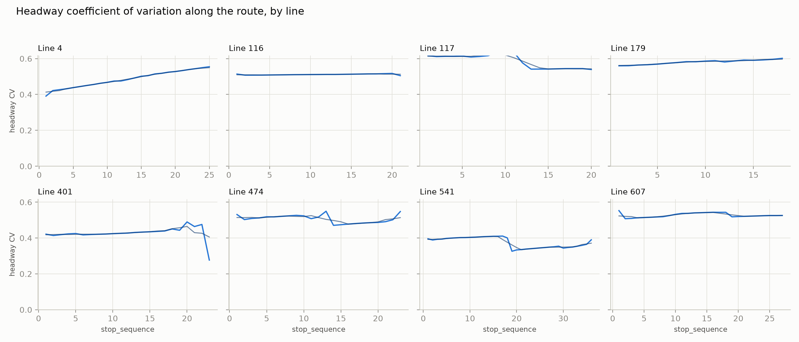
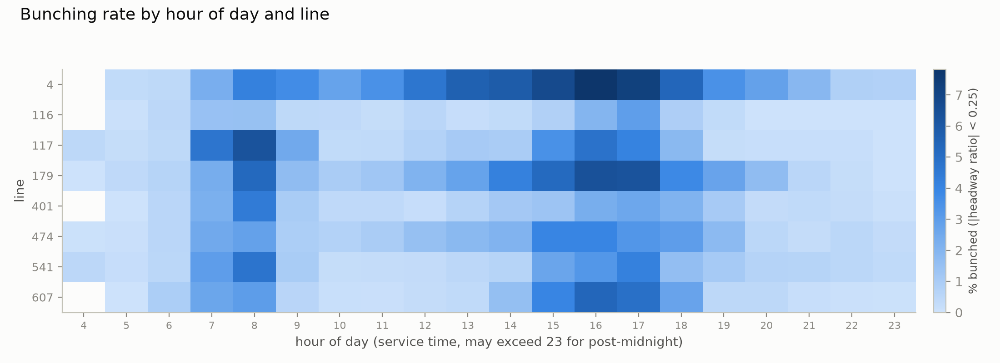
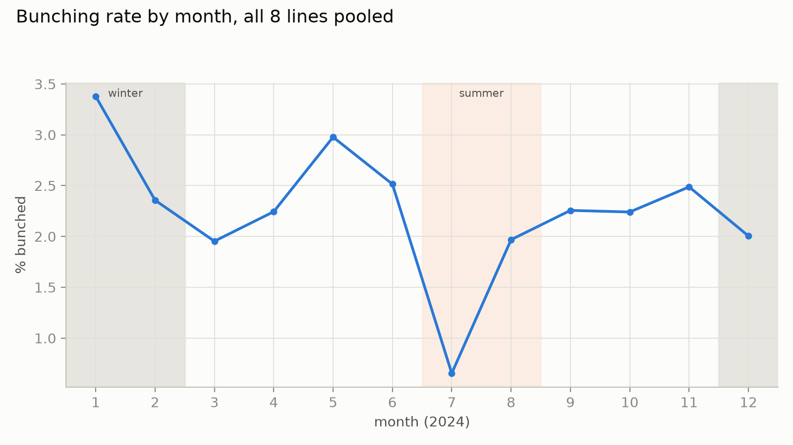
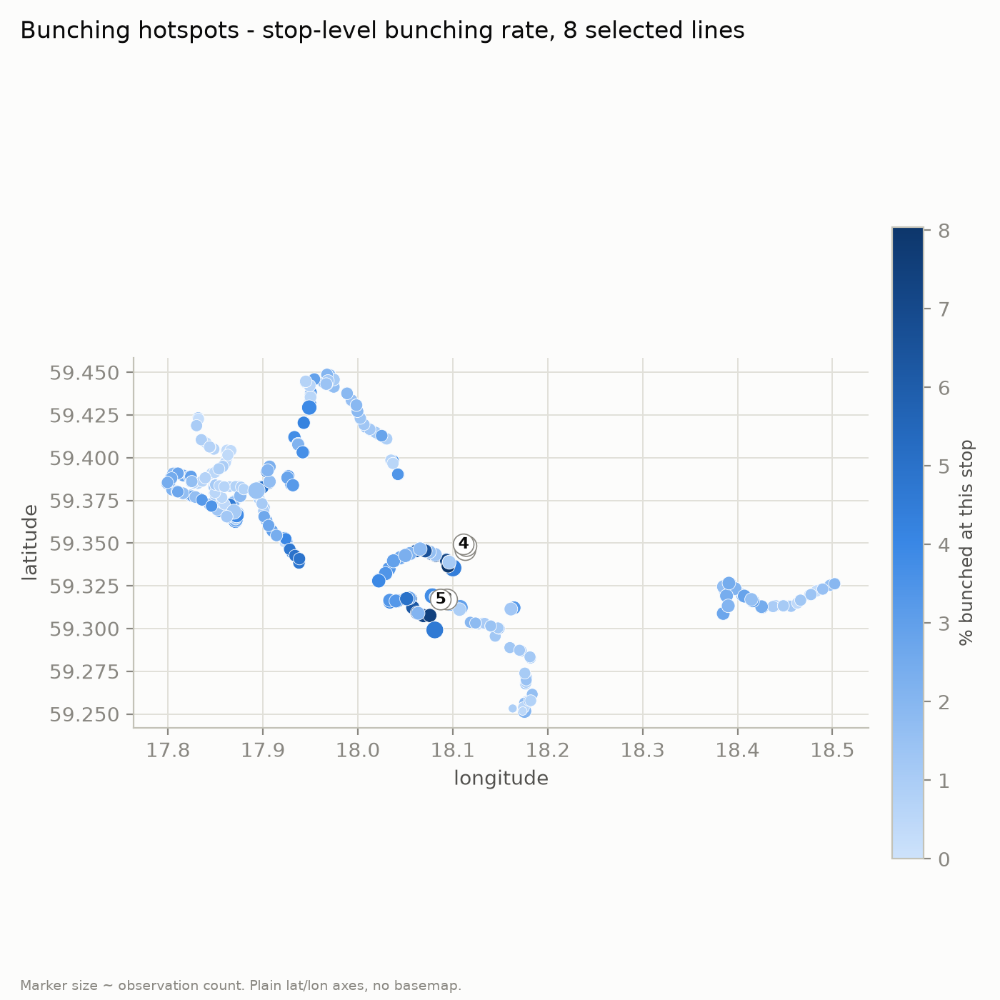
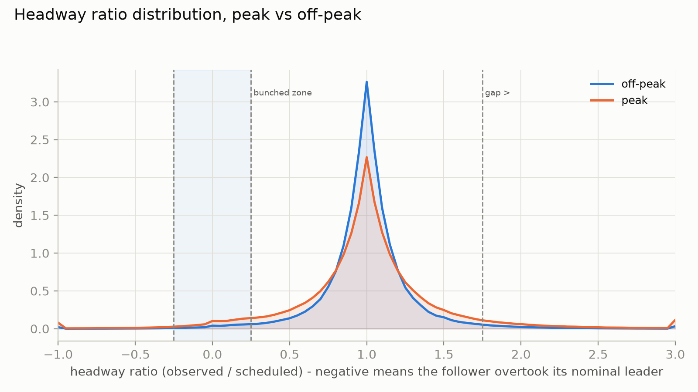
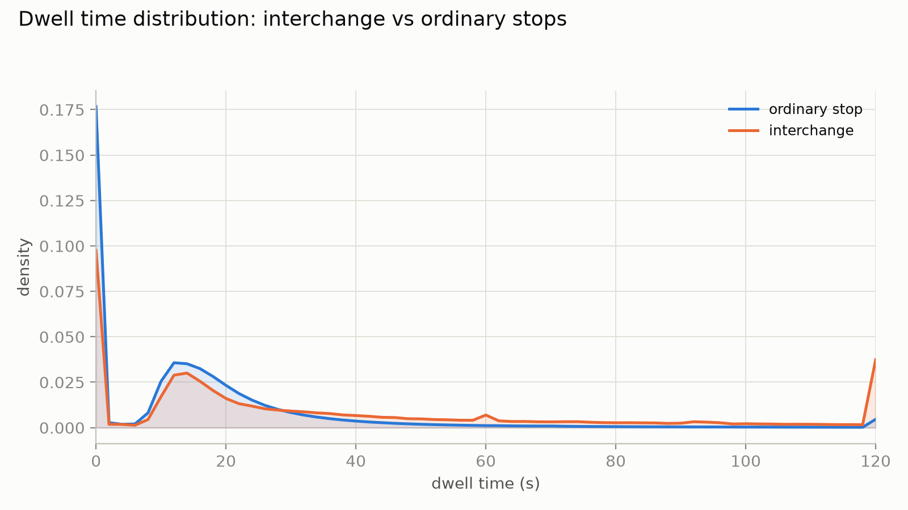
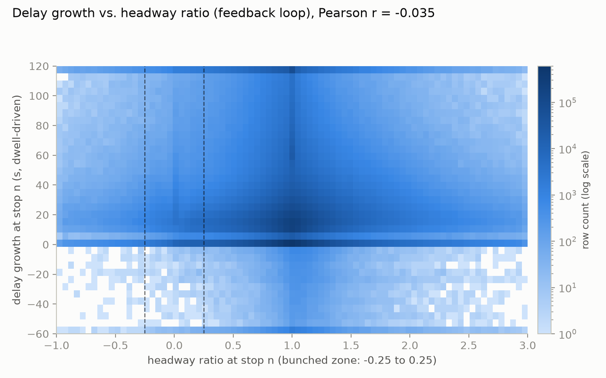

# Phase 3 - descriptive analysis (report task A)

8 selected bus lines (4, 116, 117, 179, 401, 474, 541, 607), all of 2024.
Bunching label: `abs(headway_ratio) < 0.25`, corrected as described in
`docs/02_data_usage_and_feature_engineering.md` §1.3 - a signed-ratio version
of this analysis was run first and over-counted bunching by mislabeling large
overtakes as bunched; every number below is the corrected version. Code:
`src/eda_figures.py`. Palette and chart-construction choices follow the
`dataviz` skill (categorical slot 1/2 = blue/orange, sequential = the blue
ramp, small multiples instead of an 8-colour spaghetti line chart).

---

## Figure 1 - headway CV along the route, by line (H1)

Lines 4 and 179 show a fairly clean monotonic rise in headway CV from the
start to the end of the route (line 4: ~0.40 to ~0.55; line 179: ~0.55 to
~0.60), which is the clearest support for H1 in this set. Line 401 shows the
same rise for most of its length before an apparent sharp drop at the very
last point - that drop is a small-sample artifact, not a real effect: stop
23 on line 401 is reached by only 1,231 observations across the whole year,
against ~45,000 at every earlier stop, so its CV estimate is far noisier and
should not be read as "CV falls at the terminus." Lines 116 and 607 are
essentially flat along their length, and line 117 shows a gap in the middle
of its stop range (a branch or short-turn pattern that most trips don't
traverse) followed by a step down, not a rise. Pooling all 8 lines together
(doc 2 §1.5) gave a mild but present upward drift (~0.52 to ~0.56-0.57); this
per-line view shows that pooled trend is being carried mainly by two of the
eight lines rather than holding uniformly - H1 is supported, but not
line-independent, and the report should say so rather than claim a universal
effect.

## Figure 2 - bunching rate by hour of day and line

Bunching concentrates at rush hours almost everywhere in this set: lines
117, 179, 401, and 541 peak sharply at 07:00-08:00, while lines 4, 179, 474,
541, and 607 also (or instead) peak at 15:00-17:00 - line 179 is the one
line that shows both peaks clearly. Line 4 stands apart from the rest: it is
the highest-bunching line at almost every hour, not just at rush hour,
peaking above 7.5% in the 16:00 hour, more than double most other lines'
peak-hour rate. Line 116 is the opposite case - visibly the lightest row on
the heatmap at every hour, consistent with it also having the lowest overall
base rate (Figure/doc 2 table, 0.87%). The practical reading for the
deployment section: a holding-control intervention would earn its keep
concentrated at these specific line-hour cells, not as a blanket
all-day policy.

## Figure 3 - bunching rate by month

The month curve is not a smooth winter-higher/summer-lower seasonal cycle -
January is the highest month (3.38%) and July is a sharp, isolated low
(0.65%, less than a fifth of January's rate), with June and August sitting
much closer to the January-May range than to July. Checking why: July has
the loosest scheduled headways of the year on these lines (median
`headway_sched` 900s, versus 600-650s for January-May) and the lowest
distinct-trip count (3,041, tied with the leanest months of the year) -
consistent with SL running a reduced, more generously-spaced summer
timetable in July, which mechanically makes the same absolute schedule
adherence look like a much lower bunching *rate* (a wider denominator) and
plausibly also reflects genuinely calmer operations under lower summer
demand. This is worth stating explicitly in the report as a schedule-driven
effect, not a pure demand/weather seasonal signal - conflating the two would
overstate the summer weather story (H4).

## Figure 4 - spatial hotspots

| Rank | Stop | % bunched | n |
|---|---|---|---|
| 1 | Garnisonen | 8.04 | 39,734 |
| 2 | Banérgatan | 7.70 | 39,735 |
| 3 | Skanstull | 7.44 | 42,464 |
| 4 | Värtavägen | 7.25 | 39,735 |
| 5 | Eriksdal | 7.21 | 42,475 |
| 6 | Musikhögskolan | 7.08 | 39,731 |
| 7 | Stadion | 6.86 | 39,727 |
| 8 | Östra station | 6.53 | 39,792 |

All eight hotspot stops sit on the same central-Stockholm corridor and all
carry a near-identical observation count (~39,700-42,500), which is line 4's
signature - these are almost certainly consecutive or near-consecutive stops
on that line, and the map shows them as a tight visual cluster (labelled 4
and 5 in the figure; ranks 1-3 and 6-8 overlap at the same pixels and are not
separately labelled - see the table above for the actual stops). This is
consistent with Figure 2's finding that line 4 is the standout highest-
bunching line: the spatial hotspot pattern and the line-level pattern are
the same finding viewed two ways, not two independent pieces of evidence.

## Figure 5 - headway ratio distribution, peak vs off-peak

Both distributions peak sharply at a ratio of 1 (on schedule), but peak-hour
service is visibly flatter and fatter-tailed on both sides: the off-peak
peak reaches a density of ~3.3 at ratio 1, versus ~2.3 for peak, with the
peak curve sitting above off-peak almost everywhere else on the axis,
including the small bump just below zero (genuine overtaking - a follower
that passed its nominal leader by a few seconds to a couple of minutes).
That bump is real, not noise: it is visible in both curves and tapers off
smoothly before -0.5, matching the ±30-minute validity bound chosen for
`headway_obs` in doc 2 §1.3. The practical reading: peak-hour service is not
just "somewhat busier," it is measurably less predictable in both
directions - as prone to gaps as to bunches - which matters for how a
holding-control policy should be tuned by time of day.

## Figure 6 - dwell time by stop type

Interchange stops have a mean dwell of 39.4s (median 21s) against 16.3s
(median 12s) at ordinary stops - roughly 2.4x on the mean, 1.75x on the
median, and interchange stops carry a visibly heavier right tail past 20s
where ordinary-stop density has already collapsed toward zero. This is the
clearest, least ambiguous mechanism result in this set: interchange status
is doing real work and should be a strong feature in the models, and is a
priori the stop attribute most likely to matter for RQ2 (dwell growth
predicting bunching). The uptick at the right edge of the chart (120s) is a
clipping artifact from bucketing the display at 120s, not a real spike in
120-second dwells - the underlying data was not clipped for any other
calculation in this project, only for this one plot's x-axis.

## Figure 7 - delay growth vs. headway ratio (the feedback loop)

The raw same-stop, same-trip Pearson correlation between a trip's own delay
growth and its own headway ratio is -0.035 - weak, and in the direction the
mechanism predicts (more delay growth associates mildly with a smaller,
more-bunched ratio) but far too small to be the whole story. Checking the
alternative pairing - the *leader's* delay growth (the trip ahead, whose
dwell inflation is supposed to be what closes the gap for the follower)
against the follower's headway ratio - gives an even weaker +0.018. Read
together with Figure 6 and the feature design in doc 2 §3, this is not a
contradiction of the plan's causal story so much as evidence that the
mechanism does not show up as a simple one-stop linear relationship: it is
why the trajectory feature group (`headway_ratio_lag1/2/3`, `closing_speed_3`,
`cum_delay_growth_3` - a rolling sum over 3 stops, not a single stop) exists
in Phase 4, and why H2 needs the Phase 6 ablation (delay-only vs. dwell-only
vs. both, evaluated through a model's ability to predict future bunching)
rather than this raw bivariate correlation to be properly tested. This
figure's honest contribution is to show that the effect, if real, is
cumulative and lagged rather than instantaneous - which is itself worth
reporting instead of only reporting the (much easier to obtain) 3-stop
rolling-window version.
